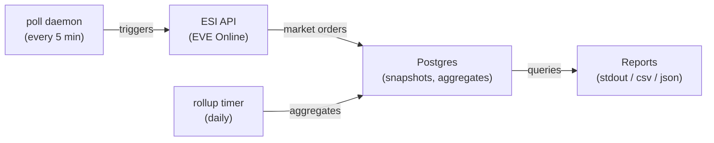
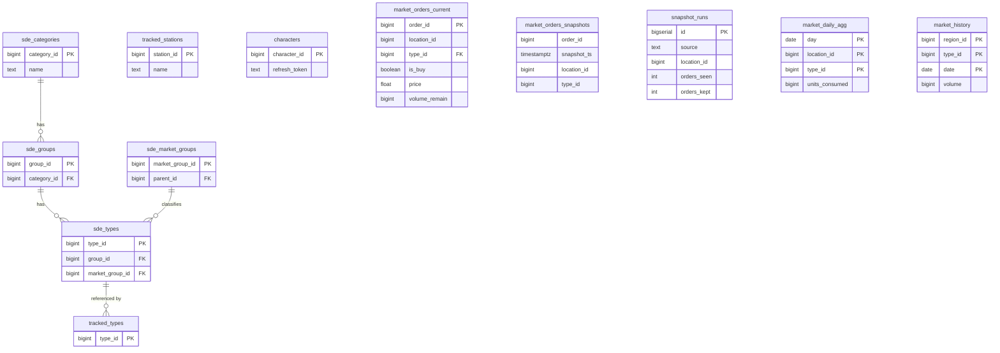

# eve-trade-hub-analyzer

Rust service that polls a single player-owned EVE Online trade hub (Upwell structure) and the Jita market region via ESI, stores market snapshots in Postgres, and produces stock-health and seeding-opportunity reports.

See `PROMPT.md` for the full build spec, `ADDENDUM.md` for overrides that win against the spec, and `DECISIONS.md` for any additional deviations.

---

## Architecture & Design

### High-Level Overview

The system is a **data pipeline** with three stages:

1. **Ingest** — periodically poll the EVE ESI API for market orders at tracked player-owned stations and the Jita trade hub region, persisting raw snapshots.
2. **Aggregate** — roll snapshots into daily summaries (price OHLC, consumption) and pull official ESI market history for Jita.
3. **Analyse** — query the stored data to produce actionable reports: what's understocked and what's profitable to import.



### Data Flow

#### 1. Static Data (SDE)

The `sde-sync` binary downloads EVE's Static Data Export from Fuzzwork's CSV dumps (categories, groups, market groups, item types) and loads them into `sde_*` tables. It's idempotent — a SHA-256 of the upstream `Last-Modified` header is stored and compared on each run to skip no-op refreshes.

#### 2. Authentication

The `auth` binary performs a one-shot EVE SSO OAuth2 + PKCE flow. It spins up a temporary local web server, walks the user through the browser-based login, then persists the character's refresh token in the `characters` table. This token is used by the poll daemon to access authenticated structure-market endpoints.

#### 3. Market Polling (`poll` daemon)

The long-running daemon executes a **poll cycle** every `POLL_INTERVAL_SECS` (default 300s / 5 min):

- **Hub poll**: For each row in `tracked_stations`, fetches `/markets/structures/{id}/` (authenticated, paginated up to 4 concurrent pages). Orders are filtered to only those whose `type_id` exists in `tracked_types`.
- **Jita poll**: Fetches `/markets/{region_id}/orders/` (public, paginated). Same type whitelist applied.

For each poll:
1. Surviving orders are upserted into `market_orders_current` (latest state).
2. A full copy is appended to `market_orders_snapshots` (time-series, weekly-partitioned).
3. A `snapshot_runs` row is written with timing, counts, and any error.

**Partition management**: Weekly partitions are created on-demand (current + next week) and dropped after 30 days of retention, keeping the snapshot table from growing unbounded.

**ESI politeness**: The client respects `X-ESI-Error-Limit-Remain` headers — when the remaining error budget drops below 10, all requests are paused until the reset window. Transient 5xx errors are retried with exponential backoff (up to 3 attempts).

#### 4. Daily Rollup (`rollup` timer)

Run once per day (via systemd timer), the rollup binary:

1. **Snapshot aggregation** — For each (location, type) pair, computes from that day's snapshots:
   - Price OHLC (open/close/min/max of the lowest sell price across snapshots)
   - Units consumed (detected via `LAG(volume_remain)` deltas between consecutive snapshots of the same order)
   - ISK consumed (units × price)
   
   Results are upserted into `market_daily_agg`.

2. **Jita history refresh** — For every type currently present in `market_orders_current` at the Jita region, fetches ESI's `/markets/{region}/history/` endpoint (up to 20 concurrent requests) and upserts into `market_history`.

#### 5. Reports (`report` CLI)

Two report types query the accumulated data:

**Stock Health** — Per (station, type) view answering "what's missing, low, or stale?"
- Joins `tracked_types × tracked_stations` to show every expected item
- Computes: lowest sell, highest buy, 5th-percentile sell/buy prices, bid-ask spread, usable sell depth (units within 5% of lowest price), oldest order age, 30-day consumption, and days-of-supply
- Sorted: missing-but-consumed items first, then ascending days-of-supply

**Seeding Opportunities** — Ranked list of items profitable to import from Jita:
- Compares the hub's 5th-percentile sell to Jita's 5th-percentile sell
- Computes gross margin per unit and `expected_isk_per_day = margin × (consumption_30d / 30)`
- Filters to positive margin + non-zero consumption + optional `--min-profit-per-day` floor
- Sorted by expected ISK/day descending

**Pricing methodology** (ADDENDUM §3): The 5th-percentile volume-weighted price uses a cumulative `SUM(volume_remain)` window function. For sells, orders are sorted ascending by price and the price where cumulative volume crosses 5% of total volume is selected. This filters out margin-trading scams and outlier prices.

### Database Schema



### Technology Stack

| Layer | Choice |
|---|---|
| Language | Rust (edition 2024, stable) |
| Async runtime | Tokio |
| HTTP client | reqwest (rustls-tls) |
| HTTP server | axum (SSO callback only) |
| Database | PostgreSQL 16 |
| DB driver | sqlx (compile-time checked queries disabled; runtime queries) |
| CLI | clap 4.x (derive macros) |
| Logging | tracing + tracing-subscriber |
| OAuth | oauth2 v5 + PKCE |
| Serialization | serde / serde_json |
| Table output | comfy-table |

### Design Principles

- **Single operator** — no multi-user, no web UI. One EVE character, one set of tracked stations/types.
- **Idempotent & crash-safe** — all writes use upserts; the poll daemon survives restarts cleanly; partitions are created on-demand.
- **Minimal external surface** — the only network calls are to ESI and Fuzzwork. No Discord, no notifications, no trading APIs.
- **Heuristic reports only** — no ML or forecasting. Simple volume-weighted percentile math.
- **Pi-friendly** — designed to run as systemd services on a Raspberry Pi with a managed Postgres database.

---

## Quick start (dev)

```sh
# 1. Bring up Postgres
docker compose up -d

# 2. Copy env template and fill in EVE_CLIENT_ID / EVE_CLIENT_SECRET
cp .env.example .env

# 3. Install sqlx-cli (once)
cargo install sqlx-cli --no-default-features --features rustls,postgres

# 4. Run migrations
sqlx migrate run

# 5. Seed the tracking tables (manual, per ADDENDUM.md §1)
psql "$DATABASE_URL" <<SQL
INSERT INTO tracked_stations (station_id, name) VALUES (1035466617946, 'My Citadel');
INSERT INTO tracked_types (type_id) VALUES (34), (35), (36), (37), (38), (39), (40);
SQL

# 6. Build
cargo build
```

## Binaries

| Binary | Purpose |
|---|---|
| `auth` | One-shot: run the EVE SSO flow and persist a refresh token |
| `sde-sync` | Download the latest Fuzzwork SDE CSVs and load the type/group/market-group tables |
| `poll` | Long-running daemon that snapshots each station in `tracked_stations` plus Jita, filtered by `tracked_types` |
| `rollup` | Roll yesterday's snapshots into `market_daily_agg` and fetch Jita ESI history |
| `report` | Print `stock-health` or `seeding` reports against the stored data |

Invoke any binary with `--help` for its flags.

## Tests

```sh
cargo test
cargo clippy --all-targets -- -D warnings
```

The `tests/auth_flow_test.rs` integration tests require `DATABASE_URL`
to point at a running Postgres (the dev `docker compose up -d` is
enough). When `DATABASE_URL` is unset they print a skip notice and
return.

## Reports

```sh
# Stock health across every tracked station; table to stdout
cargo run --bin report -- stock-health

# Restrict to one station; CSV for piping
cargo run --bin report -- stock-health --station 1035466617946 --format csv

# Seeding opportunities with a profit floor
cargo run --bin report -- seeding --min-profit-per-day 1000000 --format json
```

## Deploying to a Raspberry Pi

The repo ships systemd units in `deploy/` and the binaries are
single-file, so deployment is `cross build` → `scp` → enable units.

1. **Cross-compile on the dev host.**

   ```sh
   cargo install cross --locked
   cross build --release --target aarch64-unknown-linux-gnu \
       --bin auth --bin sde-sync --bin poll --bin rollup --bin report
   ```

   Output lands in `target/aarch64-unknown-linux-gnu/release/`.

2. **One-time host setup on the Pi.**

   ```sh
   sudo useradd --system --create-home --home-dir /var/lib/eve-trade-hub-analyzer eve-hub
   sudo mkdir -p /etc/eve-trade-hub-analyzer
   sudo install -o eve-hub -g eve-hub -m 0600 deploy/env.example \
       /etc/eve-trade-hub-analyzer/env
   sudoedit /etc/eve-trade-hub-analyzer/env   # fill in real values
   ```

3. **Install binaries.**

   ```sh
   sudo install -o root -g root -m 0755 \
       target/aarch64-unknown-linux-gnu/release/{auth,sde-sync,poll,rollup,report} \
       /usr/local/bin/
   ```

4. **Apply migrations.** Either install sqlx-cli on the Pi and run
   `sqlx migrate run`, or run migrations from the dev host against the
   managed DB before installing.

5. **Seed tracked tables.** Same `INSERT` snippet as the dev quick-start
   above.

6. **Link a character.** Run `auth` on the Pi (or any machine that can
   reach `EVE_CALLBACK_URL`) once; it writes the `characters` row and
   exits.

7. **Enable units.**

   ```sh
   sudo install -m 0644 deploy/eve-trade-hub-*.service /etc/systemd/system/
   sudo install -m 0644 deploy/eve-trade-hub-*.timer /etc/systemd/system/
   sudo systemctl daemon-reload
   sudo systemctl enable --now eve-trade-hub-poll.service
   sudo systemctl enable --now eve-trade-hub-rollup.timer
   sudo systemctl enable --now eve-trade-hub-sde-sync.timer
   ```

8. **Observe.** `journalctl -fu eve-trade-hub-poll` for the daemon;
   `systemctl list-timers` for next-run schedule.

